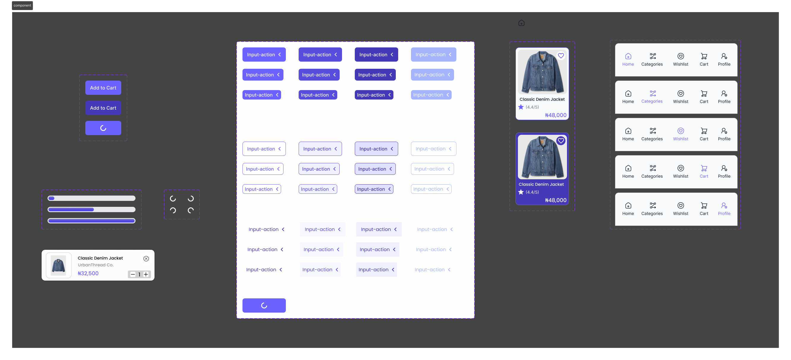

Advanced Interactive E-Commerce Prototype
📌 Project Overview

This project demonstrates an advanced interactive multi-screen e-commerce prototype built in Figma.

The goal was to implement realistic micro-interactions and smooth transitions to simulate a real shopping experience.

🎯 Objectives

Build a multi-screen user flow

Implement button state variants

Use Smart Animate for smooth transitions

Create a realistic loading state

Demonstrate an end-to-end interaction (Product → Cart → Back)

⚙️ Features Implemented

Button Variants (Default, Pressed, Loading)

Smart Animate transitions (300–400ms, Ease Out)

Loading animation with delayed navigation

Fully interactive prototype

Back navigation without auto-trigger errors

🛠 Tools Used

Figma

Component Variants

Smart Animate

Prototype Interactions

🔄 User Flow

Home Screen → Product Details → Add to Cart → Loading State → Cart Screen → Back Navigation

🎥 Demo Video

(https://drive.google.com/file/d/1--osLRLkNadt0Ap5djmUx5_fVAQTCvWz/view?usp=drive_link)

🔗 Live Prototype

(https://www.figma.com/proto/uHZ3gcqNyVD6FLE92jWEuZ/SYNTHEX-PROJECTS?page-id=236%3A534&node-id=279-933&viewport=-403%2C575%2C0.35&t=DC0aiau8vKdrs7tm-1&scaling=scale-down&content-scaling=fixed&starting-point-node-id=279%3A933)

📷 Screenshots

## 📷 Screenshots

### Advanced Interactive Overview

### Components & Variants

### Home Feed

### Product – Normal

### Cart Tab Screen

### Payment Screen

### Order Confirmation Screen

